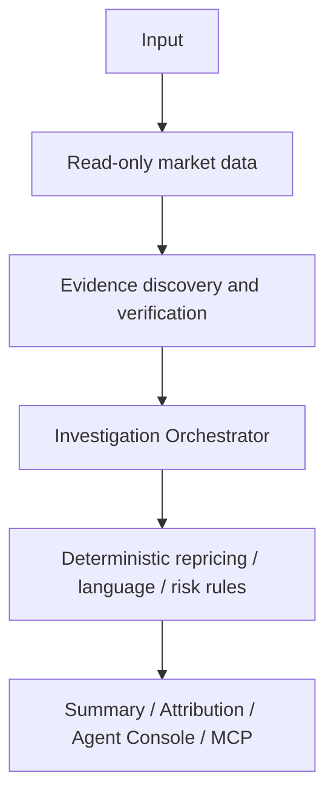

# Alibi

### Evidence-first intelligence for Polymarket wallets and agents.

**Leaderboards tell you who made money. Alibi shows what public evidence existed when they entered—and whether that context survives your delay, size, and execution constraints.**

> **PARTIALLY VERIFIED** · Read-only · Next.js 16 · TypeScript · x402 V2 · MCP
>
> [简体中文 README](README.zh-CN.md)

Alibi is an evidence-first trust-agent demo for Polymarket. It reconstructs observable timing context from public market data, public trades, deterministic repricing rules, and admitted evidence. It separates evidence-supported classification from uncertainty and abstains when coverage is insufficient.

This repository is a development snapshot. It is not a live global attribution service, does not prove insider activity or causality, and does not provide buy/sell or copy-trading advice.

## Product screenshot


This is a real recorded/local demonstration artifact. It is not a live attribution claim and does not show successful payment settlement.

## Why Alibi

Most wallet analytics answer:

- Who performed well;
- how much they made;
- how often they traded.

Alibi adds the missing context:

- what was publicly observable at entry time;
- when the market repriced;
- whether local-language and English publication windows can be separated;
- whether the evidence remains sufficient under a caller's delay, size, and slippage assumptions.

**Leaderboards answer Who. Evidence attribution explains observable Why/When. The fit layer asks Whether it still works for you.** “Why” here means evidence context, not proof of causality.

## Product vision

| Layer | What it is intended to do | Current status |
|---|---|---|
| **Discover** | Wallet discovery, ranking, recent-result metrics, lead rate, and coverage | In active development; not presented as a completed capability |
| **Explain** | Trade, public-source, and repricing timeline with multilingual evidence context | Recorded/local path implemented; live source completeness pending |
| **Fit** | Delay, size, order-book slippage, retained-return and policy comparisons | Target capability; not presented as verified |

## What is distinctive

- **Evidence-first:** claims carry source, time relation, and limitations when qualified evidence exists.
- **Multilingual timelines:** local-language and English publication windows remain distinct objective evidence states.
- **Abstention by design:** low coverage or missing evidence produces `null`, `insufficient_evidence`, `unattributed`, or `unavailable` rather than a stronger claim.
- **Agent-native:** read-only HTTP APIs, a local MCP server, and an x402 V2 payment boundary for the protected Detail path.
- **Market-level reuse:** the architecture can reuse a market timeline while aligning wallet activity separately; this is an architectural design, not a production-cost or latency claim.

## Current capability matrix

| Capability | Status | Evidence boundary |
|---|---|---|
| Read-only Polymarket Gamma, CLOB, and Data API adapters | Local/recorded verified; live behavior is bounded and provider-dependent | Public read-only data only |
| Deterministic repricing detection and evidence admission | Local/recorded verified | No LLM price or timestamp decisions |
| Bilingual source pairing and language-window states | Implemented; calibration/live completeness pending | Unknown/indeterminate when timing is not calibrated |
| Cluster-language deterministic rules | Implemented locally; reproducible real cluster evidence pending | Does not establish identity, coordination, causality, or insider activity |
| Agent Console | Local/recorded verified | Four platform Agents and nine logical Workers; read-only observation |
| x402 V2 HTTP 402 challenge | Local contract verified | `exact`, Base Sepolia, 0.01 USDC terms; no settlement claim |
| Real x402 settlement | Not verified | Requires safe Base Sepolia configuration and a separately authorized testnet run |
| MCP eight-tool local server | Local verified | Public endpoint is not verified |
| Chrome MV3 package | Local package verified | Chrome Web Store identity/public release is not verified |
| Solidity local compile and smoke | Local verified | No production deployment or mainnet transaction |
| ERC-8004 schema/preflight | Verified locally | Live registration is not enabled or claimed |
| PostgreSQL/pgvector runtime | Partial | Docker/database runtime remains unavailable in the current evidence |
| Wallet discovery/ranking | In development | No completed live ranking claim |
| Live Anthropic attribution | Not verified | Credential and live response evidence are unavailable |

## Evidence workflow



The four logical platform Agents are Evidence, Attribution, Quality & Risk, and Audit & Report. The single Orchestrator coordinates them. LLM output is not responsible for price calculation, time sorting, coverage gates, final state rules, or inventing URLs.

## Data and evidence policy

Alibi uses read-only Polymarket Gamma, CLOB, and Data API paths. Approved evidence adapters also cover sources such as SEC EDGAR, Federal Register, HKSAR, and HKMA where the source contract permits. GDELT and other aggregators are discovery-only; an original page with a valid `published_at` is required before evidence can be admitted.

`live`, `recorded`, `cached`, and `synthetic` are explicit states. Recorded fixtures retain retrieval metadata and limitations. Synthetic data is test-only and never enters the user Demo.

Temporal sequence is not proof of causality, insider activity, or information advantage. A cluster without verified source remains a separate, limited state from a documented language window.

## Free and paid boundary

- Public result metrics and Summary are free.
- Deep attribution, detailed evidence chains, and fit are the target protected capability.
- `unattributed`, `insufficient_evidence`, and provider-unavailable outcomes are not charged.
- The local repository verifies the HTTP 402 challenge boundary only.
- Base Sepolia settlement, receipt verification, and paid unlock remain unverified.
- No traditional account subscription should be inferred from this README unless the current contract explicitly enables it.

## API status

### Available in this repository

The following routes are present in the current `app/` tree. Methods are shown explicitly.

| Method | Route | Current role |
|---|---|---|
| `POST` | `/summary` | Free Summary |
| `POST` | `/attribution` | Legacy protected Detail boundary |
| `GET` | `/health` | Local health and fixture status |
| `GET` | `/audit` | Read-only JSON/Markdown audit projection |
| `GET`, `POST` | `/api/v1/summary` | v1 Summary |
| `POST` | `/api/v1/attribution` | v1 protected Detail boundary |
| `GET` | `/api/v1/health` | v1 health |
| `GET` | `/api/v1/agents/runs/<runId>` | Agent-run report |
| `GET` | `/api/v1/wallets/<address>/report` | Wallet report |
| `GET` | `/api/v1/rankings?address=<address>` | Recorded ranking replay |
| `GET` | `/api/v1/erc8004/status` | ERC-8004 status |
| `GET` | `/api/v1/subscription/status` | Subscription status |
| `POST` | `/api/v1/subscription/prepare` | Non-sending preparation response |
| `POST` | `/api/v1/subscription/verify` | Contract-shaped verification response |
| `GET`, `POST`, `DELETE` | `/mcp` | Local MCP transport |

These routes preserve the existing JSON field names, `run_id`, `data_status`, and payment boundary. This README does not introduce `/api/summary` or `/api/attribution` aliases.

### Target public contract

The following are roadmap targets, not current public endpoints:

`GET /wallet/{addr}/metrics` · `GET /wallet/{addr}/lead-rate` · `POST /assess` · `POST /screen` · `POST /market-screen` · `GET /evidence/{id}` · public MCP tools.

## Quick start

macOS/Linux:

```bash
git clone https://github.com/goldencorn1/alibi.git
cd alibi
cp .env.macos.example .env.local
npm ci
npm run verify:offline
npm run dev
```

Open `http://127.0.0.1:3000/`. The default Demo uses recorded data and does not require external credentials. Do not paste private keys or API keys into the terminal or browser.

To stop the local server, press `Control+C`. The desktop launcher, when present, starts the same recorded path and performs a local health check before opening the page.

## Modes and fixtures

- `recorded`: sanitized public-data replay with explicit recorded provenance.
- `live`: bounded read-only calls to approved upstreams; failures remain structured and do not silently become synthetic.
- `synthetic`: test and fault-injection data only; never a user-Demo source.

## Agent Console and audit reports

The Console observes the append-only audit stream for a run. It exposes statuses, data states, durations, counts, coverage, retries, cost metadata, policy flags, and redacted export paths. It does not change analysis results or expose raw prompts, model responses, credentials, private keys, full payment headers, or signatures.

The four platform Agent cards and nine logical Worker rows are local/recorded implementation evidence. A `recorded` or `unavailable` state is never promoted to `live`.

## Read-only and safety boundary

Alibi does not connect an end-user wallet, custody funds, place or cancel orders, bridge assets, copy trades, or provide buy/sell direction. x402 server code never handles a server-side private key. Mainnet and public release operations are outside this Demo's verification claim.

## Project status and documentation

The overall repository status is **PARTIALLY VERIFIED**, not `COMPLETE` and not `FULLY_LIVE_VERIFIED`.

- [Project status](docs/PROJECT-STATUS.md)
- [Roadmap](docs/ROADMAP.md)
- [Verification report](VERIFICATION.md)
- [Architecture](ARCHITECTURE.md)
- [Data sources](DATA-SOURCES.md)
- [Security boundary](SECURITY.md)
- [Demo runbook](DEMO-RUNBOOK.md)
- [Live readiness](LIVE-READINESS.md)

## License

No license is added or inferred by this showcase update. Check the repository for current licensing terms before reusing code or data.
