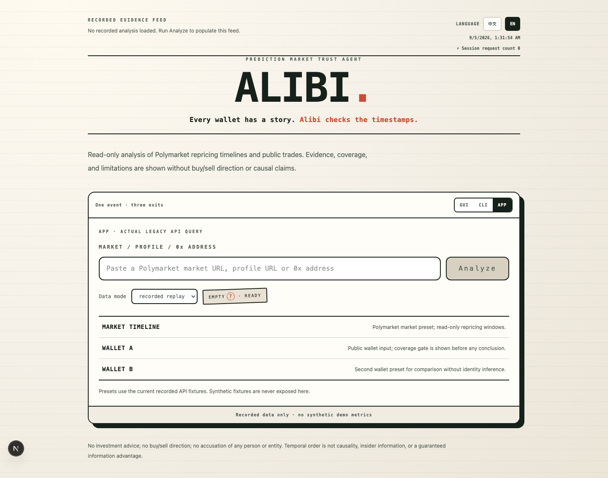
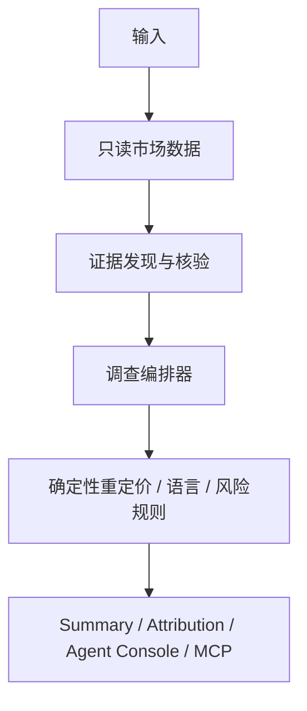

# Alibi

### 面向 Polymarket 钱包与 Agent 的时间证据智能层

**排行榜告诉你谁赚了钱。Alibi 告诉你：他们进场时公开世界已经知道了什么，以及这种背景在你的延迟、资金规模和执行条件下是否仍然成立。**

> **PARTIALLY VERIFIED（部分验证）** · 只读 · Next.js 16 · TypeScript · x402 V2 · MCP
>
> [English README](README.md)

Alibi 是一个以证据为先的 Polymarket Trust Agent Demo。它根据公开市场数据、公开成交记录、确定性重定价规则和合格证据，重建可观察的时间背景，并在覆盖不足时明确保留不确定性或弃权。

本仓库是开发快照，不是实时全球归因服务；不证明内幕行为或因果关系，也不提供买入、卖出或复制交易建议。

## 产品截图



这是实际的 recorded/local 演示证据，不是实时归因结论，也不代表支付结算成功。

## 为什么是 Alibi

普通钱包分析通常回答：谁表现好、赚了多少、交易多频繁。

Alibi 补充时间证据背景：

- 进场时公开世界可观察到什么；
- 市场何时发生重定价；
- 本地语言与英文来源的发布时间窗口是否可以客观区分；
- 在调用方的延迟、规模和滑点假设下，证据是否仍然充分。

**排行榜回答 Who；证据归因解释可观察的 Why/When；适配层询问 Whether it still works for you。**这里的 Why 指证据背景，不是因果证明。

## 产品愿景

| 层 | 目标 | 当前状态 |
|---|---|---|
| **Discover** | 钱包发现、排名、近期结果、先手率与覆盖率 | 正在开发，不作为已完成能力展示 |
| **Explain** | 成交、公开来源与重定价时间线，以及多语言证据背景 | recorded/local 路径已实现；实时信源完整性待验证 |
| **Fit** | 延迟、规模、盘口滑点、保留收益和政策比较 | 目标能力，尚未验证 |

## 设计重点

- **Evidence-first：**合格结论带有来源、时间关系和限制。
- **多语言时间线：**本地语言与英文发布时间窗口保持为不同的客观证据状态。
- **按设计弃权：**低覆盖率或缺少证据时返回 `null`、`insufficient_evidence`、`unattributed` 或 `unavailable`。
- **Agent-native：**只读 HTTP API、本地 MCP 服务和用于受保护 Detail 路径的 x402 V2 边界。
- **市场级复用：**架构可复用市场时间线并分别对齐钱包活动；这是架构设计，不是生产成本或延迟承诺。

## 当前能力矩阵

| 能力 | 状态 | 证据边界 |
|---|---|---|
| Polymarket Gamma、CLOB、Data API 只读适配器 | 本地/recorded 已验证；实时行为受上游限制 | 仅公开只读数据 |
| 确定性重定价检测与证据准入 | 本地/recorded 已验证 | LLM 不计算价格或时间 |
| 双语来源配对与语言窗口状态 | 已实现；校准/实时完整性待验证 | 未校准时保持 unknown/indeterminate |
| 集群语言确定性规则 | 本地已实现；可复现真实集群证据待验证 | 不证明身份、协调、因果或内幕行为 |
| Agent Console | 本地/recorded 已验证 | 4 个平台 Agent、9 个逻辑 Worker，只读观察 |
| x402 V2 HTTP 402 challenge | 本地 contract 已验证 | `exact`、Base Sepolia、0.01 USDC 条款；不代表结算成功 |
| 真实 x402 结算 | 未验证 | 需要安全的 Base Sepolia 配置及单独授权的测试网运行 |
| MCP 八工具本地服务 | 本地已验证 | 公共端点未验证 |
| Chrome MV3 包 | 本地打包已验证 | Chrome Web Store 身份/公开发布未验证 |
| Solidity 本地编译与 smoke | 本地已验证 | 无生产部署或主网交易 |
| ERC-8004 schema/preflight | 本地已验证 | 未启用实时注册 |
| PostgreSQL/pgvector 运行时 | 部分验证 | 当前证据中 Docker/数据库运行时不可用 |
| 钱包发现/排名 | 开发中 | 无已完成的实时排名声明 |
| Anthropic 实时归因 | 未验证 | 凭据和实时响应证据不可用 |

## 证据工作流



四个逻辑平台 Agent 是 Evidence、Attribution、Quality & Risk 和 Audit & Report；由单一 Orchestrator 协调。LLM 不负责价格计算、时间排序、覆盖率门、最终状态规则或编造 URL。

## 数据与证据政策

Alibi 使用只读的 Polymarket Gamma、CLOB 与 Data API。经批准的证据适配器还覆盖 SEC EDGAR、Federal Register、HKSAR 和 HKMA 等来源，但必须遵守各自来源 contract。GDELT 等聚合来源只用于 discovery；证据准入需要原始页面和有效的 `published_at`。

`live`、`recorded`、`cached` 与 `synthetic` 是明确区分的状态。recorded fixture 保留检索元数据和限制。Synthetic 仅用于测试，永不进入用户 Demo。

时间先后关系不是因果、内幕行为或信息优势的证明。没有已验证来源的集群与已记录的语言窗口是两个独立且有限的状态。

## 免费与付费边界

- 公开结果指标和 Summary 免费。
- 深度归因、详细证据链和 fit 是目标受保护能力。
- `unattributed`、`insufficient_evidence` 与 provider unavailable 不收费。
- 当前仓库只验证了 HTTP 402 challenge 边界。
- Base Sepolia 结算、receipt 验证和付费解锁仍未验证。
- 除非当前 contract 明确启用，否则不能从 README 推断存在传统账号订阅。

## API 状态

### 当前仓库实际存在

下列路由均来自当前 `app/` 目录，方法明确列出。

| 方法 | 路由 | 当前用途 |
|---|---|---|
| `POST` | `/summary` | 免费 Summary |
| `POST` | `/attribution` | legacy 受保护 Detail 边界 |
| `GET` | `/health` | 本地健康和 fixture 状态 |
| `GET` | `/audit` | 只读 JSON/Markdown 审计投影 |
| `GET`、`POST` | `/api/v1/summary` | v1 Summary |
| `POST` | `/api/v1/attribution` | v1 受保护 Detail 边界 |
| `GET` | `/api/v1/health` | v1 健康检查 |
| `GET` | `/api/v1/agents/runs/<runId>` | Agent 运行报告 |
| `GET` | `/api/v1/wallets/<address>/report` | 钱包报告 |
| `GET` | `/api/v1/rankings?address=<address>` | recorded 排名回放 |
| `GET` | `/api/v1/erc8004/status` | ERC-8004 状态 |
| `GET` | `/api/v1/subscription/status` | 订阅状态 |
| `POST` | `/api/v1/subscription/prepare` | 不发送交易的准备响应 |
| `POST` | `/api/v1/subscription/verify` | contract 形状的验证响应 |
| `GET`、`POST`、`DELETE` | `/mcp` | 本地 MCP 传输 |

这些路由保留现有 JSON 字段名、`run_id`、`data_status` 和支付边界。本 README 不新增 `/api/summary` 或 `/api/attribution` 别名。

### 目标公共 contract

以下是 roadmap 目标，不是当前可调用的公共端点：

`GET /wallet/{addr}/metrics` · `GET /wallet/{addr}/lead-rate` · `POST /assess` · `POST /screen` · `POST /market-screen` · `GET /evidence/{id}` · 公共 MCP tools。

## 快速开始

macOS/Linux：

```bash
git clone https://github.com/goldencorn1/alibi.git
cd alibi
cp .env.macos.example .env.local
npm ci
npm run verify:offline
npm run dev
```

打开 `http://127.0.0.1:3000/`。默认 Demo 使用 recorded 数据，不需要外部凭据。不要把私钥或 API key 粘贴到终端或浏览器。

停止本地服务请按 `Control+C`。若使用桌面启动器，它会启动相同的 recorded 路径，健康检查通过后再打开页面。

## 模式与 fixture

- `recorded`：带有明确 recorded provenance 的脱敏公开数据回放。
- `live`：对批准上游执行有边界的只读调用；失败保持结构化，不静默变成 synthetic。
- `synthetic`：仅用于测试和故障注入，永不作为用户 Demo 来源。

## Agent Console 与审计报告

Console 观察一次运行的 append-only 审计流，展示状态、数据状态、耗时、计数、覆盖率、重试、成本元数据、policy flags 和脱敏导出路径。它不改变分析结果，也不暴露原始 prompt、模型响应、凭据、私钥、完整支付 header 或签名。

四个平台 Agent 卡片和九个逻辑 Worker 行是本地/recorded 实现证据。`recorded` 或 `unavailable` 永不被提升为 `live`。

## 只读与安全边界

Alibi 不连接终端用户钱包、不托管资金、不下单或撤单、不 bridge 资产、不复制交易，也不提供买卖方向。x402 服务端代码不处理服务端私钥。主网和公开发布操作不属于本 Demo 的验证声明。

## 项目状态与文档

仓库整体状态为 **PARTIALLY VERIFIED（部分验证）**，不是 `COMPLETE`，也不是 `FULLY_LIVE_VERIFIED`。

- [项目状态](docs/PROJECT-STATUS.md)
- [路线图](docs/ROADMAP.md)
- [验证报告](VERIFICATION.md)
- [架构](ARCHITECTURE.md)
- [数据来源](DATA-SOURCES.md)
- [安全边界](SECURITY.md)
- [演示手册](DEMO-RUNBOOK.md)
- [实时就绪度](LIVE-READINESS.md)

## License

本次展示优化没有新增或推断许可证。复用代码或数据前，请先核对仓库当前许可条款。
